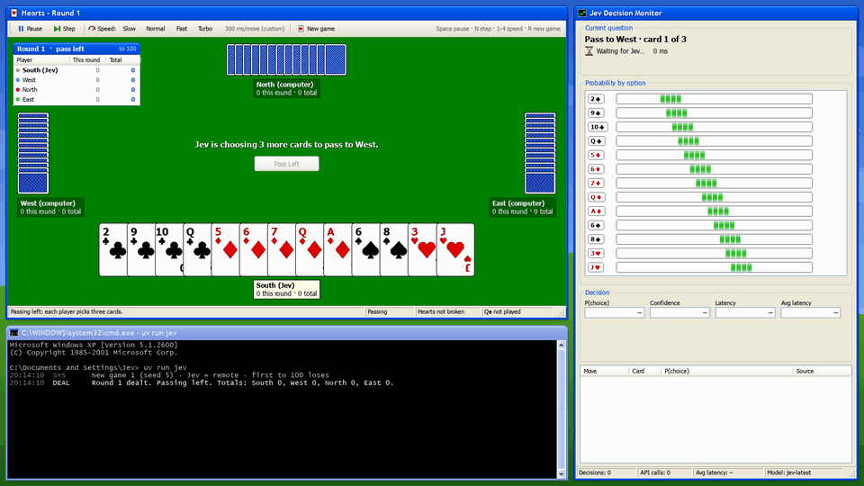

# Jev Hearts

I wanted to see how well **Jev**, a fast "system-1" model, could play Hearts. So this puts it at a table with three computer players and shows every decision it makes in one window.




*A full round with live Jev. It dumps the Q♠ on East's trick (92%) and finishes the round on 0 points.*

## Overview

Jev sits South and the other three seats are heuristic bots. On every pass and every play it gets a plain-English description of the table plus one multiple-choice question, and it answers with a probability for each legal card. Before it's asked, each legal card gets played out a few dozen times against randomly dealt hidden hands, and the average result goes at the top of that option. Hearts is turn-based, so Jev's ~150-300 ms response time doesn't matter here. It's all about whether it makes good calls.

**Over 10 full games Jev won 7 and the heuristic bot won 3** (see [Results](#results)).

There are three panes in the window:

| Pane | Shows |
|---|---|
| **Hearts** (top left) | The table, a round scoreboard with running totals, and a toolbar for pace |
| **Jev Decision Monitor** (right) | The current question, a probability bar per option, what Jev picked and why, and recent decisions |
| **Console** (bottom left) | A timestamped log of every deal, pass, play, trick and Jev call |

## Quick start

You'll need [uv](https://docs.astral.sh/uv/) and Python 3.14.

```bash
uv sync
uv run jev                 # South is played by the local heuristic (no API key needed)
uv run jev --jev remote    # South is played by Jev
```

To use Jev, copy `.env.example` to `.env` and put your key in:

```ini
JEV_API_KEY=your-key-here
JEV_MODEL=                 # optional: jev-latest (default) or jev-preview
```

A few handy flags: `--seed 42` for reproducible deals, `--delay-ms 300` for the starting pace, and `--print-request` to dump one real request body and exit.

## Controls

| Control | Action |
|---|---|
| **Pause / Resume** or `Space` | Stop or continue the game |
| **Step** or `N` | Play one move while paused |
| **Slow · Normal · Fast · Turbo** or `1`–`4` | Set the pace (1500 / 700 / 250 / 60 ms per move); `+` / `-` fine-tune it |
| **New game** or `R` | Deal a new game |
| Mouse wheel over the console | Scroll the log |
| `Esc` | Quit |

## How Jev is asked

Every decision is a `POST https://api.typesafe.ai/v1/systemone`, built by `build_request()` in `jev_agent/jev.py`.

- **State** is written as plain sentences rather than raw data: the situation, every finished trick this round, known voids (and how we know), South's sure winners, the cards still out, the pass, and the scores.
- **The question** is a single `choice` question. Only legal cards are offered, under neutral keys (`option1`, `option2`, …). Each option opens with a **Result** line so they're easy to compare, then the detail. When following suit, the highest card that still loses gets flagged as the best safe play.
- **Lookahead** lives in `hearts/simulate.py`. It plays each option out to the end of the round over 40 sampled deals (24 for a pass). The deals are consistent with everything South knows: hand sizes, voids that have shown up, and the cards South passed. Heuristic bots finish the round, and every option is run on the same deals. The Result line then states the average in words and compares it to the best option, e.g. *"Result: you take 1.8 points on average (1.3 more than the best option) - you take the Q♠ 12% of the time. Also: …"*. The old hand-written advice comes after "Also:". It costs roughly 0.5 s of local compute per play and 2 s per pass. You can switch it off in `evaluate` with `--no-lookahead`.
- **Passing** is asked three times, one card at a time.
- **Moon mode** kicks in when South has every point so far and holds the cards to take the rest. The question then becomes about shooting the moon.
- **Fallback:** if there's only one legal card, no call is made. Calls time out after 30 s and retry once on a server error. If it still fails, or the answer isn't a legal card, the local heuristic plays instead and the error shows up in the console.

### Example

This is a real exchange from round 1, trick 6. I recorded it before adding the lookahead, so with lookahead on each option would start with its simulated result instead. East has taken all 13 points so far and might be going for the moon.

<details open>
<summary><b>Request</b> (<code>tricks_this_round</code> and <code>scores</code> trimmed)</summary>

```json
{
  "model": "jev-latest",
  "state": {
    "game": "Hearts",
    "goal": "Take as few points as possible. Each heart is 1 point; the queen of spades is 13 points, as much as all the hearts together. You take the points in every trick you win. Shooting the moon: whoever takes all 26 points in a round scores 0 and every opponent scores 26 instead.",
    "you_are": "South",
    "situation": "Round 1, trick 6 of 13. East led diamonds; East is winning with the 2♦. The trick holds 0 points so far. 2 players still to play after you. Hearts are not broken yet. The Q♠ has been played; East took it. You have taken 0 points this round. East has taken all 13 points so far and could be shooting the moon. Taking even one point yourself stops it.",
    "your_hand": { "spades": "none", "hearts": "J 5 4 3", "diamonds": "K 10 7 6", "clubs": "none" },
    "tricks_this_round": [
      "Trick 1: North led 2♣; East 5♣, you A♣, West K♣. You won, no points.",
      "…",
      "Trick 5: West led 10♠; North 9♠, East K♠, you Q♠. East won and took 13 points."
    ],
    "current_trick": ["East played 2♦"],
    "known_voids": ["You have no spades or clubs."],
    "your_sure_winners": "K♦ - no unplayed card of the same suit can beat these",
    "passing": "You passed A♠ Q♥ 8♣ to West. You received Q♠ J♥ A♣ from East.",
    "still_out": {
      "spades": "J (1 card held by opponents)",
      "hearts": "A K Q 10 9 8 7 6 2 (9 cards held by opponents)",
      "diamonds": "J 9 8 5 (4 cards held by opponents)",
      "clubs": "Q J 10 9 8 7 6 4 3 (9 cards held by opponents)"
    },
    "opponents": { "West": "0 points this round", "North": "0 points this round", "East": "13 points this round" },
    "scores": { "South": "0 this round, 0 in the game (game ends at 100)", "…": "…" }
  },
  "questions": {
    "card": {
      "type": "choice",
      "instructions": "Which card should you play so that you take the fewest points, now and later in this round?",
      "criteria": {
        "option1": "Result: you take the lead for now (0 points in the trick). Play the 6♦: it takes the lead from the 2♦ (0 points in the trick). 3 higher cards (J 9 8) are still out among the 2 players after you. It takes the trick away from East, stopping their moon attempt.",
        "option2": "Result: you take the lead for now (0 points in the trick). Play the 7♦: …",
        "option3": "Result: you take the lead for now (0 points in the trick). Play the 10♦: … 1 higher card (J) is still out …",
        "option4": "Result: you win the trick and take at least 0 points. Play the K♦: nothing higher is out, so you win the trick and take its 0 points plus anything the 2 players after you throw. It takes the trick away from East, stopping their moon attempt."
      }
    }
  }
}
```

</details>

<details open>
<summary><b>Response</b></summary>

```json
{
  "model": "jev-1.13.0",
  "answers": {
    "card": {
      "type": "choice",
      "choice": "option4",
      "confidence": 0.78,
      "probabilities": { "option1": 0.07, "option2": 0.03, "option3": 0.06, "option4": 0.84 }
    }
  },
  "usage": { "input_tokens": 1418, "output_tokens": 50 }
}
```

</details>

`option4` is the **K♦**, so Jev takes the trick to stop East's moon, at 84%.

## Results

### 10 full games (with lookahead)

I ran Jev against the heuristic bot on identical deals for 10 full games to 100 points. Each seeded game is played twice, once with Jev in the South seat and once with the heuristic there. The other three seats are always heuristic bots, and every deal comes from the game seed, so both runs get the same cards. South wins if it ends with the lowest total.

```bash
uv run python -m jev_agent.evaluate --jev remote --games 10 --seed 1000
```

| | Jev | Heuristic bot |
|---|---|---|
| **Games won** | **7 / 10** | 3 / 10 |
| **Average points per round** (lower is better) | **5.54** (99 rounds) | 6.54 (111 rounds) |
| Opponent shot the moon | 2 | 2 |
| Decisions that fell back to the heuristic | 0 | – |

Ten games isn't a lot, so for context: with four identical heuristic bots, South wins about 25% of the time (24.5% over 400 local games). I also wanted to check that the lookahead signal was actually worth sending, so I ran a bot that always picks the option with the best simulated result (`hearts.simulate.LookaheadBot`) locally for 110 games. It won 65% of them at 5.53 points per round, which is right where Jev landed with 7 of 10 and 5.54. Looking back over 565 recorded decisions offline, Jev chose the best-simulated option 91% of the time, and on average it gave up 0.14 points per decision compared with that option. The heuristic gave up 0.90.

Some things that made a difference:

- **Tell Jev what happens, not just what's on the table.** A description can say a card "may win the trick", but it can't say how often that ends with you eating the Q♠. The simulated averages give Jev an actual number to compare.
- **Simulate the passes as well.** Without pass lookahead the simulation bot won 53% of games; with it, 65%.
- **Keep the hand-written advice on passes.** When I dropped it and sent only the simulated result, Jev matched the best pass slightly more often (158 vs 151 out of 180), but its mistakes were worse and the average cost went from 0.25 to 0.42 points.


## Project layout

| Path | Contents |
|---|---|
| `hearts/` | Game engine: `cards`, `rules`, the `game` state machine, `bots`, `moon` (shoot-the-moon analysis) and `simulate` (Monte Carlo lookahead) |
| `jev_agent/` | `describe` (state and option text), `jev` (API client with fallback), `evaluate`, `config`, and the CLI |
| `ui/` | The pygame window: XP-style widgets (`xp`), the `table`, `jev_panel`, `console_panel`, and `card_art` |
| `tests/` | Rules, full games, prompt text, moon logic, lookahead sampling, API client (mocked) and a headless UI render |

## Development

```bash
uv run pytest                                                # all tests; no network needed
uv run python -m jev_agent.evaluate --jev remote --hands 20  # Jev vs heuristic on identical deals
uv run python -m jev_agent.evaluate --jev remote --games 10  # full games, played in parallel
uv run --with pillow python scripts/record_gif.py --eval-seed 1044  # re-record docs/demo.gif (live Jev)
```

## License

MIT © calum-mcg, see [LICENSE](LICENSE).
